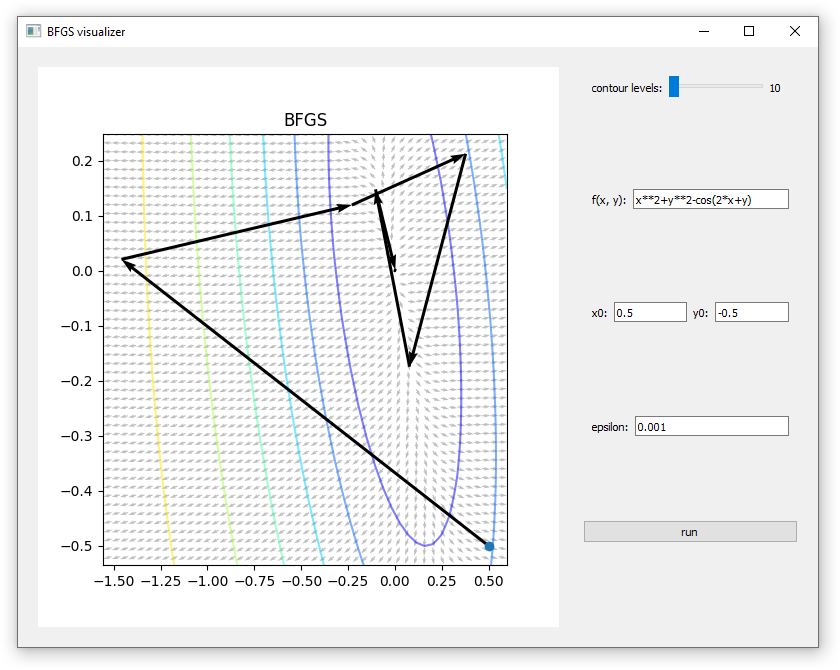

# Gradient methods visualization

This is my student project for a python programming course at SPbSTU.
The program takes an arbitrary function, automatically differentiates it using sympy library and visualizes iterations of [BFGS](https://en.wikipedia.org/wiki/Broyden–Fletcher–Goldfarb–Shanno_algorithm) optimization method, applied to this function.

## Installation
After cloning the repository, run
```
pip install -r requirement.txt
```

## Examples
To see an example of how the program works, after the installation, one can run app.py and press 'run' button with the default parameters. This is the expected output:


```
